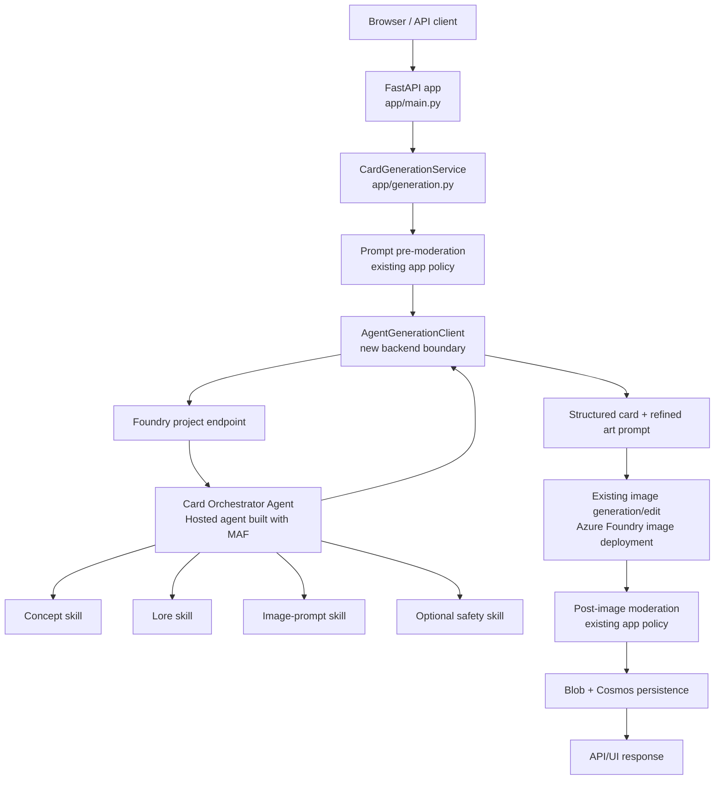

# Agent architecture with Microsoft Foundry and Microsoft Agent Framework

This document separates the current service boundaries and approved Workflow
implementation contract from the historical agent-architecture proposal below.

The direction is intentionally conservative: keep authentication, rate limiting, persistence, and HTTP/UI behavior in the existing web application, and add a Foundry-hosted agent layer only where agent reasoning adds value.

> **Current implementation:** the required `hosted_agents/card_orchestrator`
> runtime now applies the approved #168 single-call contract: one generation-stage request and one model dependency call per invocation.
> The web backend uses it for every live card-text request. The legacy direct
> text implementation, feature gate, and automatic fallback have been removed.
> See the [implemented architecture and diagram](architecture.md) and
> [invocation contract](foundry-agent-invocation.md). Deployment observations are
> recorded separately in the [operations runbook](foundry-agent-operations.md);
> they are not fresh live verification. The proposal and earlier inventories
> below are historical design context, not the current implementation inventory.
> The runtime's 20-second model stages / 65-second overall deadline remain
> enforced. Historical latency proposals below are not current-runtime acceptance gates.

## Current #168 single-call workflow contract (implemented)

The executable graph in `hosted_agents/card_orchestrator/workflow.py` is now:
`decode -> pre_prompt -> generation -> generation_merge -> final_safety -> terminal`.
These are the concrete `build_workflow()` node IDs (`decode`, `pre_prompt`,
`generation`, `generation_merge`, `final_safety`, `terminal`), with conditional
early-stop edges to `terminal` from `decode`, `pre_prompt`, and
`generation_merge`.

- `decode` validates one typed `GenerateCardAgentRequest`.
- `pre_prompt` runs moderation and emits exactly one specialist payload:
  `{"query": request.query}`.
- `generation` is the only `AgentExecutor`; it performs one model dependency
  call with strict schema output, `store=false`, `stream=false`, tools disabled,
  SDK retries disabled, and `max_tokens=1800`.
- `generation_merge` validates executor identity/evidence, revalidates the full
  `GeneratedCardModel`, and blocks invalid/missing evidence before terminal.
- `final_safety` enforces required ordered allow evidence for
  `pre_prompt`, `generation`, `final_text`, `final_art_prompt`, derives
  `artPrompt`, and produces the final schemaVersion 1 response envelope.
- `terminal` is the only `output_from` node and serializes either a valid domain
  envelope or the bounded runtime-failure marker.

Execution invariants: one request-local workflow, one request-local specialist
resource scope, one model call on success, one absolute 65-second request
deadline, 20-second model-stage timeout, and no cross-request mutable state.
Current detail-release bounds are one HOSTED record and five WEB records; #164
multi-stage concept/lore/art graphs remain historical context only.

## Historical Workflow engine contract (#164 r1, superseded by #168 current contract)

[Requester approval on 2026-09-22](https://github.com/bmoussaud/fantasy-cards-generator/issues/164#issuecomment-5775375929)
authorized the historical internal engine migration track. This section is kept as
labeled #164 context. Current runtime documentation is superseded by approved #168
single-call generation behavior and should not be interpreted as today's execution
contract.
The requester subsequently
[approved keeping the current implementation and creating the PR without performance acceptance](https://github.com/bmoussaud/fantasy-cards-generator/issues/164#issuecomment-5778665499).
No r2 startup preparation or host migration is included. The pre-#164 runtime used
MAF `Agent`/`FoundryChatClient` inside an application-owned stage loop. That baseline
was not a MAF Workflow, and wrapping that loop in one executor does not satisfy #164.

### Engine and host are separate

`WorkflowBuilder` edges dispatch three actual `AgentExecutor` instances;
`WorkflowAgent` is the agent-facing wrapper over that graph. The existing
`ResponsesAgentServerHost`, `StatelessBoundary` and typed response adapter remain
the protocol boundary. Keep `agent-framework-core==1.17.0`,
`agent-framework-foundry==1.12.0` and `azure-ai-agentserver-responses==2.1.0`
with the resolved frozen lock; internal Workflow execution does not intrinsically
require an upgrade.

The reference is the [immutable official workflow sample at
e21140c78898067be2899995c67f1ed24db6fe1c](https://github.com/microsoft/agent-framework/blob/e21140c78898067be2899995c67f1ed24db6fe1c/python/samples/04-hosting/foundry-hosted-agents/responses/workflows/main.py),
checked against the [matching release source at
4507512f95effaae4518d658e86e9afc0ccb4514](https://github.com/microsoft/agent-framework/tree/4507512f95effaae4518d658e86e9afc0ccb4514/python/packages)
in #164. Its `ResponsesHostServer` is a different, separately packaged hosting
adapter, not the Workflow engine. The sample-era hosting package requires core
`>=1.19.0,<2` and Responses `>=2.2.0b1,<3`; even the matching-release hosting
package requires Responses `>=2.2.0b1,<3` and lacks the later factory API.
Adopting it needs separately qualified dependency and boundary-equivalence work,
not a conclusion that the official adapter can never be used. Source inspection
is not resolved-provider, container or live integration proof.

### Typed graph and request ownership

The success path is: typed request decode -> pre-prompt safety -> Concept
`AgentExecutor` -> concept merge/gate -> Lore `AgentExecutor` -> lore merge/gate ->
Art Direction `AgentExecutor` -> art merge/gate -> final text/art safety ->
terminal envelope. In `workflow.py`, these are `decode`, `pre_prompt`, `concept`,
`concept_merge`, `lore`, `lore_merge`, `art_direction`, `art_direction_merge`,
`final_safety` and `terminal`. Conditional stopped-outcome edges from decode,
pre-prompt and the three merge nodes lead directly to terminal.

- The decoder accepts the `WorkflowAgent` message input and validates the domain
  request. Concept receives `{"query": validated_query}`. Lore receives
  `{"card": validated_and_moderated_concept_card}`; art receives the complete
  validated concept-plus-lore card. The sample's raw `last_agent` forwarding is
  insufficient. Lore may refine only `name`/`flavorText`, art only `artBrief`;
  each merge revalidates the whole card and preserves mechanics.
- Each executor uses the public `SupportsAgentRun` protocol through a
  request-local `DeferredSpecialist`; it constructs the actual Agent only when
  reached and invokes it with the executor's fresh session. `StageBoundary`
  middleware preserves authoritative provider
  refusal precedence and parsing/validation/moderation inside the original
  measured specialist span. Deterministic graph nodes verify typed results and
  trusted safety evidence and construct the next input; they neither duplicate
  model/moderation calls nor trust model-authored evidence.
- Every request owns fresh workflow/executors, agent sessions and mutable card,
  evidence and diagnostic state. SDK sibling tasks must not rely on a
  `ContextVar` update in another child task. No cross-request mutable state,
  conversations, checkpoints or state persistence is introduced. The only shared
  contract cache is lazy, bounded to three immutable schema/instruction string
  pairs; `effective_schema()` supplies a fresh mutable dictionary for each Agent.
  It caches no SDK objects, request data or diagnostic state, and does not prepare
  the Workflow at startup.
- Refusal, held/deferred results and invalid evidence stop downstream specialists;
  dependency failures travel internally as payload-free `FailureCode` values.
  Only `TerminalEnvelope` is selected by `output_from`. Domain outcomes return one
  schemaVersion 1 envelope; an internal failure marker is translated back into
  the existing bounded `RuntimeFailure`, never exposed as a successful response.
  No intermediate messages, candidates or graph events reach the public wire.
- The pre-prompt gate precedes resource acquisition. The request task owns its
  `AsyncExitStack`; graph/request event handshakes close it before final safety
  and mandatory terminal serialization. Cancellation drains graph activity
  before closing live resources, and all owned tasks drain before HOSTED content
  acceptance. One absolute 65-second deadline covers scheduling, acquisition,
  closure, serialization/revalidation and batch preflight; model-stage calls
  retain their 20-second limit. No node starts a fresh operation deadline. The
  [original-span and release contract](operational-monitoring.md#workflow-task-contexts-164-historical-168-current)
  remains binding.

Exactly three model calls occur on success, with strict per-stage schemas,
1,800-token limits, `store=false`, `stream=false`, no SDK retries or tools.
There is no autonomous routing, fan-out, repair loop, new specialist, model/prompt
policy change or API/UI addition. Image generation, artwork retry, auth,
idempotency and persistence remain WEB-owned. Workflow/provider telemetry is not
the three original custom spans and does not authorize payload logging.

The [offline acceptance requirements](agent-evaluation.md#single-call-migration-acceptance-168-r2)
must prove real edge execution, isolation, lifecycle and public compatibility.
There is no promise of an automatic Foundry portal graph, better quality, lower
cost or lower latency. Root deployment/rollback procedures are unchanged and need
separate authorization. Historical #162 dev-v9 original-span evidence is not
acceptance evidence for this graph.

### Performance disposition

The requester waiver removes performance as a #164 PR acceptance gate, not
functional, safety, privacy or cleanup requirements. The offline first-ready wave
was **11.71 seconds / 9.54 MiB**, above the former **5 seconds / 8 MiB** study
thresholds. These are nonproduction, nonblocking observations, not passing
benchmarks or production capacity measurements. Runtime timeouts, admission,
sampling and content byte/span limits remain unchanged; no further optimization
or r2 startup preparation is implied.

## Historical proposal: executive summary

The remaining proposal and earlier inventories preserve their original design
context. References below to direct text calls, skills, optional safety/repair
agents or future hosting choices are not the #164 implementation scope.

The current application already has a clean generation pipeline: authenticate the user, validate the request, moderate the prompt, generate structured card text, derive an art prompt, generate or edit artwork, moderate the result, then persist metadata and image assets.

That pipeline works, but its creative reasoning is currently concentrated in one text-model call plus deterministic Python glue. Introducing Microsoft Foundry agents gives the application a better place to hold multi-step creative reasoning, card-design critique, and prompt refinement without moving user/session ownership or persistence into model code.

**Recommended target architecture:**

- keep the existing FastAPI application in Azure Container Apps as the public API/UI surface
- add **one Microsoft Foundry hosted agent** built with the **Microsoft Agent Framework (MAF)** as the orchestration entrypoint for agentic reasoning
- implement the initial specialist behaviors as **MAF skills inside the hosted agent**
- optionally externalize mature specialists into separate **Foundry prompt agents** later if independent versioning is needed
- keep image generation, image-edit retry semantics, Blob/Cosmos persistence, and most request policing in the existing backend

In short: use agents for **creative orchestration**, not for **core application control-plane concerns**.

## Why agents fit this application

Agent-based reasoning is useful here because card generation is not only a single completion problem. The application must:

- translate a loose player prompt into a coherent fantasy-card design
- keep the output structured and game-shaped
- generate original lore/flavor text without drifting into copyrighted or unsafe content
- refine an image prompt that is strong enough for image generation/editing
- support future extensions such as critique/rewrite loops, house-style enforcement, and offline evaluation

A hosted agent is a better long-term home for those responsibilities than adding more prompt-shaping logic directly into `app/generation.py`.

## Historical architecture recap

### Application layer today

The current application is a Python FastAPI service loaded through `app/entrypoint.py` and assembled in `app/main.py`.

The main generation path is:

1. authenticated request reaches `POST /api/v1/cards/generate` or the UI equivalent
2. request parsing, CSRF validation, and ownership enforcement happen in `app/main.py`
3. `CardGenerationService` in `app/generation.py` runs the generation workflow
4. prompt moderation runs before any model call
5. `AzureFoundryAIClient` calls the current Azure AI Foundry/OpenAI deployments directly:
   - text via chat completions
   - image generation or image edit via image endpoints
6. post-text, art-prompt, and post-image moderation decisions are applied
7. successful results persist to Cosmos DB + Blob Storage; partial artwork failures return `awaiting_artwork_retry`
8. telemetry and bounded dependency logging flow through `app/telemetry.py`; `/healthz` probes Cosmos and Blob via `app/health.py`

### Current service boundaries

Today, the backend already has strong boundaries worth preserving:

- **HTTP/session/auth boundary:** `app/main.py`, `app/auth.py`
- **runtime configuration boundary:** `app/settings.py`
- **generation orchestration boundary:** `app/generation.py`
- **operability boundary:** `app/telemetry.py`, `app/health.py`
- **state boundary:** Cosmos for metadata/audits and Blob for images/photos

### Infrastructure and deployment today

The deployment topology is currently centered on a single Python web service in `azure.yaml`:

- `web-nat` runs as an Azure Container App
- infra is provisioned with Bicep from `infra/`

`infra/main.bicep` already provisions most of the platform needed for a future agent design:

- Azure Container Apps environment and app
- Azure Container Registry
- Key Vault
- Azure Monitor / Application Insights / Log Analytics
- Cosmos DB
- Storage account + private endpoint
- Azure AI Foundry account, project, and model deployments
- network resources and private endpoints

The app uses the **Foundry account endpoint** (`FOUNDRY_ENDPOINT`) for images
and the **Foundry project endpoint** for required hosted-agent operations.

### Documentation style and conventions already present

The existing docs in `docs/` use:

- concise architecture prose
- explicit environment/configuration tables
- stable API contracts
- operational notes, rollout cautions, and security warnings

This document follows the same style.

## Proposed architecture

### Design principles

1. **Do not move authentication, ownership, or persistence into agents.**
2. **Do not replace deterministic safety gates with open-ended reasoning.**
3. **Do not break the current response contract or artwork-retry behavior.**
4. **Prefer one hosted orchestrator first; split into more deployable agents only when the boundaries prove stable.**
5. **Keep phase 1 tool usage minimal.** The card generator does not currently need broad web search, arbitrary MCP tools, or direct data-store write tools.

## Recommended agent topology

### 1. Card Orchestrator Agent — required

**Type:** Foundry hosted agent  
**Implementation style:** code-first, Python, Microsoft Agent Framework  
**Responsibility:** the single agent entrypoint called by the web app for creative reasoning

This hosted agent should own the agentic part of card generation:

- decompose the user's fantasy-card prompt
- run a structured concept pass
- run a lore/style pass
- run an art-prompt refinement pass
- optionally run a self-critique/repair loop before returning structured output

This is the recommended place to use MAF because the workflow is multi-step and benefits from code-defined orchestration, schema validation, and explicit boundaries.

### 2. Card Concept Specialist — logical agent/skill

**Phase 1 form:** MAF skill inside the Card Orchestrator  
**Phase 2 optional form:** standalone Foundry prompt agent

Responsibilities:

- convert the user's prompt into a structured card concept
- choose card type, rarity, mana, attack, health, and rules shape
- keep output aligned with the existing JSON schema used by `GeneratedCardModel`

### 3. Lore and Flavor Specialist — logical agent/skill

**Phase 1 form:** MAF skill inside the Card Orchestrator  
**Phase 2 optional form:** standalone Foundry prompt agent

Responsibilities:

- refine card name and flavor text
- improve thematic coherence between mechanics and narrative
- enforce “original fantasy” tone without leaning on copyrighted franchises or living-artist imitation

### 4. Image Prompt Specialist — logical agent/skill

**Phase 1 form:** MAF skill inside the Card Orchestrator  
**Phase 2 optional form:** standalone Foundry prompt agent

Responsibilities:

- transform approved card content into an image-safe art prompt
- preserve style constraints needed by the current image deployment
- produce a prompt suitable for both pure generation and reference-photo edit flows

### 5. Safety Review Specialist — optional, advisory only

**Phase 1 form:** MAF skill or omitted entirely  
**Phase 2 optional form:** standalone Foundry prompt agent with narrow instructions

Responsibilities:

- flag likely policy problems before the app spends image-generation budget
- suggest rewrite guidance when the concept or art brief looks risky

This specialist should be **advisory**, not authoritative. The final enforcement points should remain deterministic or platform-managed:

- existing prompt/text/image moderation checks in the app
- Azure AI Content Safety where already used
- Foundry guardrails attached at the hosted-agent or model level

## Hosted vs prompt agents: recommendation

### Recommended initial shape

Use **one hosted agent** as the deployed runtime boundary and keep the first specialist behaviors as internal MAF skills.

Why:

- the current workflow already needs precise control over schema, retries, partial completion, and telemetry
- the app must preserve `awaiting_artwork_retry` semantics
- reference-image handling and persistence compensation remain easier in the current backend
- this avoids prematurely creating four separately versioned runtime resources

### When to add standalone prompt agents

Introduce separate prompt agents only when one of these becomes true:

- a specialist prompt needs independent lifecycle/versioning
- a non-Python team wants to tune instructions without changing orchestration code
- evaluation shows a specialist benefits from separate prompt-only optimization
- a future UX wants to expose one specialist directly (for example, a lore-only assistant)

## Integration with the existing app

### Boundary decision

The web app remains the system of record for:

- authentication and session state
- request validation and CSRF
- rate limiting
- owner scoping
- persistence to Cosmos/Blob
- image bytes and image retry flow
- API/UI contracts

The agent layer becomes a **new upstream dependency** of `CardGenerationService`.

### Proposed call sites

`app/generation.py` is the correct integration point.

Replace the current single-step text-generation responsibility with a new `AgentGenerationClient` or similar boundary that:

1. calls the hosted Foundry agent through the project endpoint
2. receives structured card output plus a refined art prompt
3. hands the art prompt back to the existing image-generation path

The rest of the current Python workflow can remain mostly intact:

- pre-prompt moderation stays before the agent call
- post-agent moderation replaces today’s post-text moderation and art-prompt moderation checks
- image generation/edit remains in the app using the existing image deployment
- post-image moderation, persistence, and compensation remain unchanged

### Proposed phase-1 data flow



### Request contract between app and agent layer

The current public API should remain unchanged. The **internal** app-to-agent contract should be explicit and versioned.

#### `GenerateCardAgentRequest`

```json
{
  "schemaVersion": 1,
  "query": "Create a moonlit guardian with a shield of stars"
}
```

Notes:

- do **not** send raw auth tokens, session cookies, or PII
- do **not** send raw owner IDs unless the agent genuinely needs them
- serialize exactly this JSON in one user `input_text`, with `store:false` and
  `stream:false`; query is trimmed and limited to 1–400 characters
- caller-supplied policy, constraints, image/reference-image fields and owner
  hashes are not supported by the current runtime

#### `GenerateCardAgentResponse`

```json
{
  "schemaVersion": 1,
  "status": "completed",
  "card": {
    "schemaVersion": 1,
    "name": "Moonshield Warden",
    "cardType": "hero",
    "rarity": "rare",
    "manaCost": 6,
    "attack": 8,
    "health": 9,
    "rulesText": "...",
    "flavorText": "...",
    "artBrief": "..."
  },
  "artPrompt": "Safe original fantasy trading card illustration ...",
  "metadata": {
    "agentName": "card-orchestrator",
    "agentVersion": "v1",
    "modelDeployment": "gpt-5-5"
  },
  "safetyHints": []
}
```

If the agent cannot safely complete, it should return a **structured refusal/failure payload**, not free-form text. The app should translate that into the existing `ProblemDetails` model.

### Retry and partial-result semantics

The current implementation already has a valuable behavior: if text succeeds but artwork fails, the user gets a partial card and can retry artwork later.

That behavior should remain.

Therefore:

- the agent should complete **before** image generation begins
- the agent should not own Blob/Cosmos writes
- the existing `retry_artwork` flow should continue to reuse the persisted validated payload and derived art prompt

In the new world, the persisted payload would simply contain **agent-derived** card content and art prompt instead of **single-call text-model-derived** content.

## How the agents are hosted and deployed

### Recommended runtime model

### Public web app

- stays in Azure Container Apps
- continues to serve HTML, API routes, auth callbacks, health probes, and media streaming

### Agent runtime

- runs as a **Foundry hosted agent** in the existing Azure AI Foundry project
- is built in Python with the **Microsoft Agent Framework**
- is deployed as a separate agent workload, not as another HTTP route inside the public web container

This separation is useful because it:

- isolates prompt/instruction evolution from the public web app
- makes agent traces/evaluations first-class Foundry concerns
- avoids turning the web app into a monolithic “do everything” runtime

## Code-first hosted agent vs prompt agents

### Code-first hosted agent

Use this for the **Card Orchestrator Agent**.

Why it fits:

- multi-step orchestration
- structured inputs/outputs
- explicit skill registration
- future toolbox support if needed
- cleaner observability and versioning for an agent runtime

Expected artifacts in a future implementation:

- a dedicated hosted-agent source folder in this repo
- `agent.yaml` for runtime/metadata/policy declaration
- Python agent entrypoint using MAF
- deployment via `azd` agent workflow into the existing Foundry project

### Prompt agents

Use only for narrow specialists if they later need independent lifecycle management.

Good candidates:

- lore-only tuning
- art-prompt rewriting
- internal critique agent

Not recommended for phase 1 as the primary runtime boundary.

## Microsoft Agent Framework usage pattern

The Microsoft Agent Framework should be used for:

- defining the hosted orchestrator agent
- registering specialist skills/components
- controlling agent-side tool access
- optionally connecting to a Foundry toolbox later
- keeping the agent runtime code-first and testable

In this design, MAF is the code-first layer that unifies the useful parts of
Semantic Kernel-style skills/plugins and AutoGen-style orchestration patterns
without forcing the web application itself to become the agent runtime.

Phase-1 recommendation: **no general toolbox yet**.

This application does not currently need broad external tools such as web search, arbitrary MCP servers, or direct file/database actions. Starting without a toolbox reduces latency, cost, and prompt-injection surface.

If future capabilities require tools, add them narrowly through a toolbox and keep the allowlist short.

## `agent.yaml` expectations

A future hosted agent should declare:

- agent identity/name/version
- runtime entrypoint
- model deployment bindings
- optional guardrail/policy attachment
- environment variables required by the agent runtime

If Foundry guardrails are used at the hosted-agent layer, the guardrail attachment belongs in the agent definition rather than being hand-improvised in application code.

## Infrastructure changes needed

The repo already provisions a Foundry account, project, and model deployments, so this is an extension of the existing pattern rather than a greenfield platform.

## Changes to `infra/main.bicep`

1. **Expose a Foundry project endpoint for the app runtime**
   - the account endpoint remains for image generation
   - the **project endpoint** is required for all live card-text generation
   - runtime variable: `FOUNDRY_PROJECT_ENDPOINT`

2. **Grant the Container App managed identity project-scope access**
   - current infra gives the deployer `Foundry User` on the project
   - the application runtime will also need a project-scope role assignment to invoke agents
   - keep existing account-scope model access for image generation

3. **Add configuration for agent invocation**
   - inject non-secret settings for the agent name/version
   - examples:
     - `FOUNDRY_PROJECT_ENDPOINT`
     - `FOUNDRY_AGENT_NAME`
     - `FOUNDRY_AGENT_API_VERSION` (defaults to `v1`)
     - `FOUNDRY_AGENT_EXPECTED_VERSION` (optional; metadata check against agent response version)

4. **Optionally provision Foundry guardrail resources**
   - if the team wants managed RAI policies beyond the current heuristic/content-safety gates, define them in the Foundry account and reference them from the agent/model configuration

5. **Preserve the current account endpoint variables**
   - the app still needs account-endpoint model access for image generation/editing

## Changes to `infra/modules/ai-foundry.bicep`

Recommended additions:

- new output for project endpoint
- new role assignment for the Container App identity at **project scope** (not only account scope)
- optional RAI policy resources/outputs if the team decides to standardize on Foundry guardrails

## Changes to `infra/modules/container-apps.bicep`

Add env vars for the application-to-agent integration while keeping the current Foundry/OpenAI env vars intact.

Implemented settings:

- `FOUNDRY_PROJECT_ENDPOINT` (already present)
- `FOUNDRY_AGENT_NAME`
- `FOUNDRY_AGENT_EXPECTED_VERSION`
- `FOUNDRY_AGENT_API_VERSION`

## Changes to `azure.yaml`

The current `azure.yaml` defines only the `web-nat` Container App service.

For a future implementation, extend the topology to include a dedicated hosted-agent service managed by `azd`, for example:

- `web-nat` — `host: containerapp`
- `card-orchestrator` — `host: azure.ai.agent`

That keeps a clean split between:

- public application runtime
- Foundry-hosted agent runtime

If the team later decides to place the hosted agent in a separate repo, the contract in this document still holds, but the single-repo azd topology is the simplest first move.

## Secrets and managed identity

No new user secrets should be introduced for normal runtime calls.

Preferred approach:

- web app uses `DefaultAzureCredential`
- hosted agent uses platform-managed identity/runtime auth
- project/model access is granted through RBAC
- any future toolbox or external connector secret stays in Key Vault or Foundry-managed connection surfaces, not in source control

## New Python dependencies to plan for

The current root `pyproject.toml` already contains `azure-identity`, `httpx`, FastAPI, and observability packages.

Add these for the agent architecture:

| Package | Why |
|---|---|
| `agent-framework` | Build the Foundry hosted orchestrator with Microsoft Agent Framework |
| `azure-ai-projects` | Call Foundry project/agent capabilities from the web app and support prompt-agent/project interactions |
| `azure-ai-agents` | Optional lower-level agent-service operations if needed by the implementation path |
| `azure-identity` | Already present; continue using it for RBAC-based auth |

Notes:

- `azure-identity` is already present and should remain the standard auth library.
- `azure-ai-projects` is the most important new dependency for the app-side invocation path.
- `azure-ai-agents` may remain optional if `azure-ai-projects` fully covers the chosen runtime contract.
- If the hosted agent code is kept in a separate folder with its own dependency file later, the team can narrow package placement at implementation time.

## Security and Responsible AI considerations

### Core rule: agents are not trusted with unrestricted side effects

User prompts, saved-photo context, and intermediate model outputs must all be treated as untrusted input.

### Recommended security posture

1. **No direct data-store tools for the agent in phase 1**
   - do not let the agent write to Cosmos or Blob
   - persistence stays in application code

2. **No general web search in phase 1**
   - fantasy card generation does not require internet grounding today
   - adding search would enlarge prompt-injection and copyright risk

3. **Schema-first outputs**
   - the agent must return structured JSON aligned to the existing card schema
   - the backend must still validate the result before use

4. **Keep existing deterministic moderation checkpoints**
   - pre-prompt moderation before agent execution
   - moderation on agent-returned card text and art prompt
   - post-image moderation after image generation

5. **Use managed guardrails where helpful, but do not rely on them alone**
   - attach Foundry guardrails to the hosted agent and/or deployments if adopted
   - retain app-level safety checks as defense in depth

6. **Redaction and telemetry discipline**
   - continue existing privacy posture from `app/telemetry.py`
   - do not log raw prompts, generated card text, image prompts, image bytes, identities, or tokens in agent/application telemetry

### Prompt injection considerations

Even without web search, prompt injection still matters because user prompts can attempt to alter system behavior.

Mitigations:

- keep the hosted agent’s instruction hierarchy explicit and stable
- keep tool access minimal
- validate output schema and allowed enums/ranges in the backend
- treat all agent text as data, not executable instructions
- never let agent output decide authorization, storage scope, or RBAC behavior

### Copyright and originality considerations

This application already blocks living-artist imitation and obvious copyrighted-character requests. The agent design must preserve and strengthen that posture.

Recommendations:

- instruct specialists to produce **original fantasy** content only
- reject style-transfer or artist-imitation requests early
- keep final image publication behind post-image moderation
- capture only sanitized audit metadata when requests are blocked

## Migration and rollout plan

### Phase 0 — architecture only

- produce this specification
- no runtime changes

### Phase 1 — add the hosted orchestrator in shadow mode

- build a Foundry hosted `card-orchestrator` agent with MAF
- do **not** change the public API contract
- call the agent alongside the current text-generation path for sampled/internal traffic
- compare:
  - schema validity
  - latency
  - moderation rejection rates
  - thematic quality
  - prompt-to-art coherence

This phase is where Samwise should define golden test prompts and evaluation fixtures.

### Phase 2 — agent-only text/card design, image generation in app

- route every live text-generation request through the agent
- keep image generation/edit, moderation, persistence, and retry behavior in `app/generation.py`
- surface structured agent failures without a direct text fallback

### Phase 3 — deepen agent specialization

- split internal skills into independently versioned prompt agents only if warranted
- optionally add critique/repair loop for better consistency
- optionally add managed Foundry guardrails and evaluation suites

### Phase 4 — optional advanced tooling

Only if real requirements appear:

- toolbox-backed retrieval for approved lore/style assets
- prompt optimization/eval workflows in Foundry
- broader agent observability and continuous evaluation

## Backward-compatibility requirements

Any implementation should preserve:

- current public API routes and payload shapes
- authenticated ownership semantics
- `awaiting_artwork_retry` behavior
- Cosmos/Blob document shape unless an explicit migration is approved
- health and telemetry discipline

## Open questions and risks

### Region/runtime availability findings (issue #96)

**Repo-verified deployment region configuration**

- The IaC is currently **single-region and parameterized**, not hard-coded to one checked-in Azure region: `infra/main.bicep` defines a single `location` parameter (defaulting to `resourceGroup().location`) and passes that shared value into the downstream modules, including Azure AI Foundry (`infra/main.bicep:1-2`, `infra/modules/ai-foundry.bicep:1-2`).
- `azd` injects that deployment location through `AZURE_LOCATION` in `infra/main.parameters.json` (`infra/main.parameters.json:8-10`).
- No committed `.azure` environment state in this repo pins a live deployed region. The checked-in handoff notes explicitly say subscription and location are still deferred until deployment handoff (`.azure/deployment-plan.md:49`, `.azure/deployment-plan.md:519-527`).
- The only concrete region value currently present in checked-in docs/examples is **`eastus2`** via the provisioning steps in `README.md` and `infra/README.md` (`README.md:64-66`, `README.md:97-103`, `infra/README.md:70-72`).

**What this means today**

- Based on source control alone, **`eastus2` is the only repo-evidenced candidate region**, but the actual live deployment region for the current Azure subscription/environment is still **not conclusively verified from the repo**.
- The current Foundry model defaults are:
  - text deployment alias `gpt-5-5` → model `gpt-5.5` with `GlobalStandard` SKU (`infra/main.bicep:106-115`)
  - image deployment alias `gpt-image-2` → model `gpt-image-2` with `GlobalStandard` SKU (`infra/main.bicep:121-130`)
- The architecture document's hosted `card-orchestrator` example response also names `gpt-5-5` as the model deployment returned by the agent layer (`docs/architecture-agents-foundry.md:310-312`).

**Externally sourced region/runtime checks (Microsoft Learn, retrieved 2026-09-04)**

- Microsoft Learn's Foundry region-support page lists **East US 2** as a supported region for creating Foundry projects and explicitly says to use feature-specific pages to confirm the exact feature/model combination before deployment: <https://learn.microsoft.com/en-us/azure/foundry/reference/region-support>
- Microsoft Learn's Foundry Agent Service quotas/regions page lists **East US 2 = Yes** for **Responses API** and **Agents**, which is the closest public confirmation that the target region supports the hosted-agent runtime needed by the proposed `card-orchestrator`: <https://learn.microsoft.com/en-us/azure/foundry/agents/concepts/limits-quotas-regions>
- Microsoft Learn's Foundry model region-availability matrix shows **`eastus2` = ✅** for:
  - `gpt-5.5` (`2026-04-24`) under **Global Standard**
  - `gpt-image-2` (`2026-04-21`) under **Global Standard**
  Source: <https://learn.microsoft.com/en-us/azure/foundry/foundry-models/concepts/models-sold-directly-by-azure-region-availability>
- Confidence level: **medium-high for `eastus2` specifically**, because the public documentation is explicit for that region. Confidence is **low for any other actual deployment region** until the team confirms the real `AZURE_LOCATION` / deployed resource-group location in the live subscription.

**Quota assessment**

- The best repo evidence for initial load is still modest: the checked-in deployment plan classifies the workload as **low traffic: fewer than 100 requests/day** (`.azure/deployment-plan.md:40-49`), and the architecture proposal says phase 1 should add the hosted orchestrator in **shadow mode** for sampled/internal traffic before any live switchover (`docs/architecture-agents-foundry.md:579-586`).
- That implies the first hosted-agent rollout mainly adds **one Agent Service + text-model hop per sampled generation request**, while the existing `gpt-image-2` image generation path remains in the app.
- **UNRESOLVED — requires live Azure subscription check.** Public docs can confirm supported regions and default service behavior, but they **cannot** confirm this subscription's allocated quota/capacity for `gpt-5.5`, `gpt-image-2`, or any production rollout headroom in the chosen region.
- Before implementation, run a live quota check against the real subscription and region (for example via the Foundry portal **Manage → Quota** with **Show all** enabled, plus Azure CLI checks such as `az cognitiveservices usage list --location <region>` and any model-specific quota views available to the subscription).

**Remaining open items**

- Confirm the actual live deployment region(s) for the active `azd` environment(s) and resource groups; do not rely on the checked-in `eastus2` example alone.
- In that same subscription/tenant, verify that the Foundry project can create/use hosted agents in the selected region, not just that the docs say the region is supported globally.
- Confirm live quota/capacity for `gpt-5.5` and `gpt-image-2` in the selected region and whether any increase request is needed before phase-1 agent rollout.
- If the real deployment region is **not** `eastus2`, rerun the region/model support check against that specific region before implementation.

### Latency budget findings (issue #97)

**Current backend timeout budget, from code**

- Runtime defaults today are:
  - `UPSTREAM_MAX_RETRIES=2`
  - `IMAGE_MAX_RETRIES=0`
  - `UPSTREAM_BASE_BACKOFF_SECONDS=0.15`
  - `TEXT_TIMEOUT_SECONDS=20.0`
  - `IMAGE_TIMEOUT_SECONDS=150.0`
  - `OVERALL_TIMEOUT_SECONDS=225.0`
  (`app/settings.py:187-212`; also documented for operators in `docs/card-generation-api.md:229-240`)
- The public card-generation request is wrapped in `asyncio.wait_for(..., timeout=OVERALL_TIMEOUT_SECONDS)`, so the whole backend flow has a hard **225 second** ceiling (`app/generation.py:1722-1737`).
- The text/card-design hop runs first, before any image generation, via `_retry_upstream(... service_name="foundry-text" ...)` (`app/generation.py:1972-1979`).
- `_retry_upstream()` applies the **text timeout + generic retry count** to every non-image dependency and the **image timeout + image retry count** only to `foundry-image` (`app/generation.py:2635-2778`).
- The removed direct text path previously could consume **60.45 seconds** before failing:
  - three `20.0s` attempts (`UPSTREAM_MAX_RETRIES=2` means initial try + 2 retries)
  - plus `0.15s + 0.30s = 0.45s` exponential backoff
- The normal image path then gets **one 150.0 second attempt** (`IMAGE_MAX_RETRIES=0`) (`app/settings.py:188-205`, `app/generation.py:2078-2103`, `app/generation.py:2774-2778`).
- In the worst case, the current text + image envelope is therefore **210.45 seconds**, leaving only about **14.55 seconds** inside the existing 225-second request budget for local moderation, persistence, and response serialization.
- If image generation times out or fails **after** validated text/art prompt exist, the backend persists a partial record with `status="awaiting_artwork_retry"` instead of failing the whole request (`app/generation.py:1740-1761`, `app/generation.py:2103-2129`, `app/generation.py:2293-2310`). The retry endpoint then reuses the persisted validated payload and derived art prompt and retries **only** artwork generation (`app/generation.py:1793-1879`, `app/generation.py:2183-2232`). The public API contract documents that `200 OK` partial-response behavior (`docs/card-generation-api.md:99-100`).

**Current agent-only latency and failure decision**

- Keep the external request ceiling at **225.0 seconds**, the hosted-agent
  timeout at **70.0 seconds**, and the image timeout at **150.0 seconds**.
- Do not retry or replace a failed agent response with direct card-text
  generation. Timeout, transient service failure, `routing_defer`,
  authentication/authorization, configuration, parse/contract failure, and
  policy refusal map to bounded structured errors.
- Preserve `awaiting_artwork_retry` only after safe, validated agent text exists
  and the non-reference image stage fails or times out.
- Reference-image edit failure remains a hard structured error.

### Project-endpoint and RBAC findings (issue #98)

**Repo-verified current configuration**

- Historical baseline before #146:
  - `infra/main.bicep` injects `FOUNDRY_ENDPOINT` as `https://${aiFoundryAccountName}.cognitiveservices.azure.com/` plus the text/image deployment aliases into the Container App (`infra/main.bicep:441-444`, `infra/modules/container-apps.bicep:279-292`).
  - The historical app loaded account-oriented text and image deployment settings.
    The current web runtime retains only the account endpoint/image deployment
    and adds required project-endpoint/agent settings.
  - Runtime calls use `DefaultAzureCredential` against the **Cognitive Services** audience (`https://cognitiveservices.azure.com/.default`) and then post straight to `/openai/deployments/...` on `self.settings.foundry_endpoint` (`app/generation.py:1271-1275`, `app/generation.py:1306-1310`, `app/generation.py:1369-1377`, `app/generation.py:1501-1508`, `app/generation.py:1548-1556`).
- The IaC does already provision a **Foundry project** resource, but it currently exposes only the project name/resource ID and only grants:
  - `Cognitive Services User` at **Foundry account scope** to the Container App identity for direct account access (`infra/modules/ai-foundry.bicep:62-64`, `infra/modules/ai-foundry.bicep:137-145`)
  - `Foundry User` at **Foundry project scope** to the deployer principal (`infra/modules/ai-foundry.bicep:147-154`)
- There is **no current app setting for a Foundry project endpoint**, no project-endpoint output from the Bicep module, and no project-scope runtime assignment for the Container App identity.

**Externally sourced project-endpoint and RBAC requirements (Microsoft Learn, retrieved 2026-09-04)**

- Microsoft Learn's Foundry SDK overview says Foundry project APIs use a **project endpoint** in this format:
  `https://<resource-name>.services.ai.azure.com/api/projects/<project-name>`
  and recommends the Foundry SDK / Agent Framework path for agents and other Foundry-specific features, rather than direct OpenAI-style deployment calls: <https://learn.microsoft.com/en-us/azure/foundry/how-to/develop/sdk-overview>
- Microsoft Learn's Foundry authentication doc says project-endpoint callers using Microsoft Entra ID should request tokens for the **Foundry audience** `https://ai.azure.com/.default`, not the Cognitive Services audience used by the current direct-inference code: <https://learn.microsoft.com/en-us/azure/foundry/concepts/authentication-authorization-foundry>
- Microsoft Learn's Foundry RBAC doc defines the relevant project/data-plane roles:
  - **Foundry Agent Consumer** (`eed3b665-ab3a-47b6-8f48-c9382fb1dad6`) for principals that only need to **interact with agent endpoints**
  - **Foundry User** (`53ca6127-db72-4b80-b1b0-d745d6d5456d`) for principals that need to **create agents, perform model inference, and interact with agents**
  It also explicitly says **not** to use the `Cognitive Services*` roles or **Azure AI Developer** for Foundry project access: <https://learn.microsoft.com/en-us/azure/foundry/concepts/rbac-foundry>
- Microsoft Learn's hosted-agent permissions reference adds the hosted-agent-specific split:
  - the **project managed identity** needs **Foundry User on the Foundry account** so the project can access model deployments through the project endpoint
  - the **calling application/service principal** should usually get **Foundry Agent Consumer at project scope** (or narrower **agent scope**) if it only invokes the deployed agent
  - hosted-agent deployment later adds other project-identity requirements such as **Container Registry Repository Reader** on ACR and **Log Analytics Data Reader** when evaluations are enabled
  - Microsoft also notes that the automatic Foundry User assignments happen when a project is created through the **portal UI** and do **not** automatically carry over to SDK/CLI/IaC provisioning flows
  Source: <https://learn.microsoft.com/en-us/azure/foundry/agents/concepts/hosted-agent-permissions>

**What this changes for this repo**

- We should treat the future agent path as a **second Foundry configuration surface**, not a rename of the existing one:
  - keep `FOUNDRY_ENDPOINT` + deployment aliases for the current direct `/openai/deployments/...` image/text calls
  - add a separate app setting such as `FOUNDRY_PROJECT_ENDPOINT` (or equivalent) that resolves to `https://${aiFoundryAccountName}.services.ai.azure.com/api/projects/${aiFoundryProjectName}`
  - switch the future agent client to Microsoft Entra tokens for `https://ai.azure.com/.default`
- The minimum role-assignment plan for project-scoped agents is:
  1. **Foundry project managed identity → Foundry User on the Foundry account scope** so the project itself can reach the underlying model deployments.
  2. **Container App managed identity → Foundry Agent Consumer on the Foundry project scope** if the backend only invokes the hosted agent at runtime.
  3. Escalate the Container App identity to **Foundry User** on the project only if the app is expected to create/update agents dynamically rather than just invoke an already-deployed agent.
  4. When/if the hosted agent package is actually deployed, add the project-identity assignments and connections required for ACR/image pull and any evaluation telemetry.
- The current `Cognitive Services User` assignment on the Container App identity is still correct for the **existing account-endpoint direct inference path**, but it is **not sufficient by itself** for project-scoped agent access.

**Recommendation**

- **Defer the actual Bicep/RBAC change to a follow-up implementation issue rather than landing speculative IaC now.** That implementation follow-up is tracked as **issue #109**.
- Rationale:
  - The repo does **not** yet contain the hosted agent resource/application, project-endpoint client wiring, or a stable runtime contract for whether the backend will merely **invoke** an agent (`Foundry Agent Consumer`) or also **manage** one (`Foundry User` / broader project permissions).
  - The exact least-privilege scope also depends on whether the team uses a **project-wide agent endpoint** assignment or a narrower **agent-scope** assignment after the first agent exists.
  - Adding RBAC alone right now would not create an end-to-end validated path, because the application still authenticates to `https://cognitiveservices.azure.com/.default` and still posts to the account endpoint.
- Once the agent runtime contract is finalized, the implementation work should be small and explicit:
  - emit a project-endpoint output from `infra/modules/ai-foundry.bicep`
  - inject a new project-endpoint app setting into `infra/main.bicep` / `infra/modules/container-apps.bicep`
  - add the required project/account role assignments for the project managed identity and the Container App managed identity
  - validate against the real hosted-agent deployment path in the same PR

1. **Region/runtime availability**  
   Hosted-agent support, model availability, and quota must be checked against the actual deployment region strategy before implementation.

2. **Latency budget**  
   The hosted-agent request has a 70.0-second bound and no direct text fallback;
   the 150.0-second image budget and `awaiting_artwork_retry` behavior remain.

3. **Project endpoint vs account endpoint confusion**  
   The current app uses the account endpoint for model inference. Agent operations need project-aware configuration and RBAC.

4. **Operational ownership**  
   The team operates two independently deployed runtimes: the public web app and the
   hosted agent runtime. The implemented monitoring contract, project-level
   Application Insights linkage, and immutable-version redeployment rollback are
   defined in
   [agent-operational-ownership.md](agent-operational-ownership.md).

5. **Evaluation readiness**  
   The team needs a stable prompt set and review rubric before changing production generation behavior.

6. **Safety-policy drift**  
   If heuristic moderation, Content Safety, and Foundry guardrails disagree, the team needs a clear precedence order.

7. **Reference-image flow scope**  
   Phase 1 intentionally keeps image bytes out of the agent layer. If future designs want the agent to reason over image input, the privacy, latency, and cost model must be re-reviewed.

## Final recommendation

Proceed with a **single Foundry hosted orchestrator agent built with Microsoft Agent Framework**, integrated into the existing backend as a new upstream dependency for card-design reasoning only.

Do **not** move auth, persistence, or image-retry control into the agent layer. Do **not** start with a broad toolbox. Keep the current FastAPI + Container Apps application as the stable shell, and let the agent layer evolve behind that boundary.

---

## Moderation and safety contract (issue #101)

The full contract — active layers, stages, conflict precedence, error
classification, retry/fallback rules, and current gaps — lives in
[architecture-agents-safety.md](architecture-agents-safety.md).

The integration-relevant summary is:

### Active layers today (backend-only)

Two backend moderation layers are active today, but they do **not** cover the
same inputs:

1. **Heuristic moderation** (`app/generation.py`,
   `HeuristicModerationService`) applies to card text and generated-image
   payload checks at `pre_prompt`, `post_text`, `post_art_prompt`, and
   `post_image`. It is deterministic and authoritative for those stages.

2. **Azure AI Content Safety** (`app/photos.py`,
   `ContentSafetyPhotoModerationService`) applies only on the saved-photo
   write path: library uploads and generation requests that use
   `save_photo=true` before persistence. Unsaved inline reference-image
   uploads still bypass this layer today.

Azure Content Safety is not used for card text or generated images today, and
`MODERATION_SERVICE` remains locked to `"heuristic"`.

### Precedence rules summary

- **Authoritative backend deny wins.** No agent allow, retry, or fallback may
  reverse an authoritative backend denial.
- **Optional advisory safety signals stay advisory.** The proposed Safety
  Review Specialist remains optional/advisory only.
- **Hosted-orchestrator structured refusal/failure is not optional advice.**
  The original architecture already requires the app to map a structured
  refusal/failure payload into `ProblemDetails`; that outcome must not be
  bypassed by another generation path as though it were merely advisory.
- **Managed guardrail denial is likewise authoritative if guardrails are later
  adopted/configured as required.**
- **Agent failures do not authorize a safety bypass.** They surface as bounded
  structured errors and do not invoke a replacement text generator.
- **Required-layer outage or missing required evidence is not allow.** Inactive
  means “not applicable”; unavailable or indeterminate required safety means
  fail/hold.

### Conflict and precedence table

| Scenario | Current behavior | [FUTURE] behavior |
|----------|------------------|------------------|
| Heuristic BLOCK on text stage | `422`; later stages do not run and no card/blob/refusal audit is persisted | Same |
| Heuristic BLOCK on `post_image` after image/image-edit success | `422 generated_art_rejected`; bytes discarded and no card/blob/refusal audit persisted | Same |
| Saved-photo Content Safety threshold exceedance | `422 saved_photo_rejected` | Same |
| Saved-photo Content Safety endpoint missing or Azure HTTP error | `503`; upload blocked | Same |
| Saved-photo Content Safety missing category evidence | **Current gap:** parser may still allow | Treat as INDETERMINATE / block if that layer is required |
| Hosted orchestrator structured refusal + heuristic ALLOW | `422 prompt_rejected`; no card/blob/refusal audit persisted | Same; no fail-open replacement path |
| Hosted orchestrator structured technical failure + heuristic ALLOW | Bounded operational error; TTL-limited content-free failure audit may be retained | Same |
| Optional advisory safety-skill concern + no authoritative deny | N/A | Advisory only; backend/managed authoritative layers still decide |
| Managed guardrail denial + heuristic ALLOW | N/A | Deny; no fallback around the guardrail |
| Agent technical failure with no authoritative deny | N/A | Bounded structured error; no replacement text path |
| Upstream image-edit failure on reference-image path | Hard error (`502`/`504`) | Same unless future policy explicitly changes it |
| Successful reference-image edit followed by `post_image` heuristic BLOCK | `422 generated_art_rejected`; no persistence | Same |
| Idempotency replay of an operational `audit_failed` record | Replays stored structured failure fields first; legacy reason-code fallback is secondary | Same |

Refusal safety does not use compensating Cosmos deletion. Same-instance
duplicates share an in-memory single flight, and the durable card or retry-audit
reservation is delayed until every applicable moderation stage has allowed.
Cross-replica duplicates may repeat upstream work before the deterministic
reservation winner persists the single card result; this bounded cost tradeoff
prevents failed cleanup from retaining refusal metadata.

### Open gaps relevant to agent integration

1. **Unsaved inline reference photos still bypass Content Safety.** See
   [architecture-agents-safety.md §8](architecture-agents-safety.md#8-photo-moderation-and-card-generation--interaction).
2. **Content Safety still has missing-evidence and exception-normalization
   gaps.** Today, absent/empty `categoriesAnalysis` can still allow, and not
   every service failure becomes a named `503`. See
   [architecture-agents-safety.md §3](architecture-agents-safety.md#3-layer-2--azure-ai-content-safety-reference-photo-uploads).
3. **Foundry guardrails are not yet integrated.** Issue #109 is the
   endpoint/config/RBAC invocation follow-up, not automatic proof that the
   full hosted runtime plus guardrail enforcement exists. If the team later
   adopts guardrails as required, follow
   [architecture-agents-safety.md §9](architecture-agents-safety.md#9-future-foundry-guardrails-integration-contract).
4. **`MODERATION_SERVICE` is still single-engine.** Extending additional
   moderation engines into card-text paths requires revisiting that lock.
