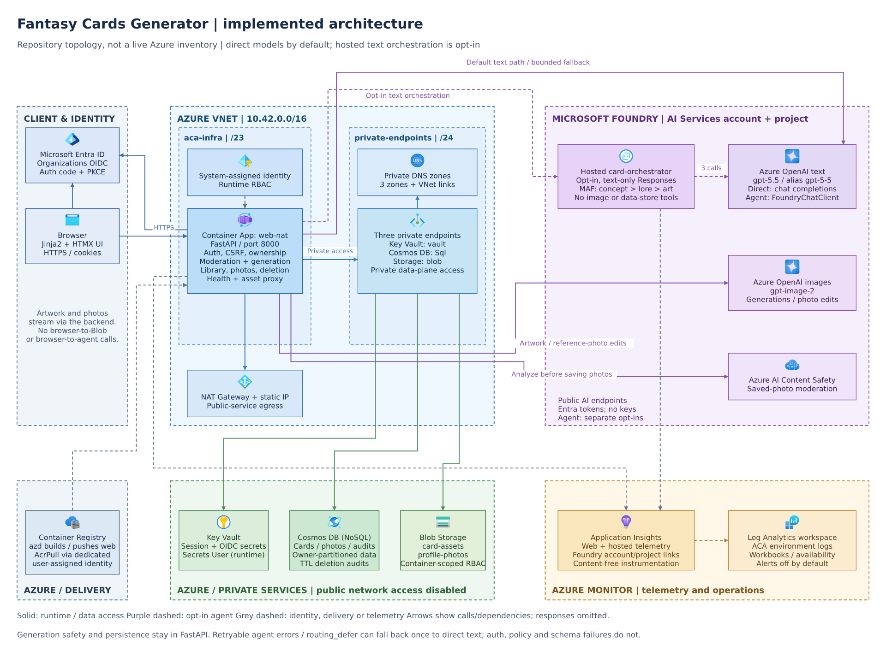

# Implemented architecture

[Editable source](architecture.drawio) | [Self-contained SVG](images/architecture.svg)

This diagram describes the current repository implementation and infrastructure
defaults, not a fresh inventory of live Azure resources. Historical deployment
records and proposed extensions are not evidence that a feature is enabled in
every environment.

## Runtime boundaries

The public application is one FastAPI Container App (`web-nat` in `azure.yaml`),
serving Jinja2/HTMX pages and JSON APIs on port 8000 behind HTTPS ingress. The
browser authenticates with Microsoft Entra ID's multi-tenant `organizations`
OIDC flow; the backend performs authorization-code exchange with PKCE, maintains
the signed session, and enforces CSRF and owner-scoped access.

`CardGenerationService` keeps rate limiting, idempotency, deterministic moderation,
image calls, artwork retry semantics, and persistence in the web application.
Its default text path calls the `gpt-5-5` deployment (model `gpt-5.5`) directly.
When `AGENT_GENERATION_ENABLED=true`, it invokes a separately deployed
`card-orchestrator` through the Foundry project's Responses endpoint. The hosted
runtime executes three sequential Microsoft Agent Framework specialists:
concept, lore, and art direction. These are internal specialists, not three
separate hosted services.

The agent receives text, not uploaded photos, user/session credentials, or
data-store access tools. Retryable/transient failures and `routing_defer` can
fall back once to the direct text path within the existing overall budget.
Authentication, configuration, policy, and schema failures do not bypass the
agent through fallback. Images still use the web backend's `gpt-image-2`
generation or reference-photo edit calls. Saved-photo uploads additionally use
Azure AI Content Safety; this is distinct from the generation pipeline's
heuristic moderation and model-side content filtering.

Cards, saved-photo metadata, and audit records share Cosmos DB. Artwork and
saved photos/thumbnails use the `card-assets` and `profile-photos` Blob
containers. The backend streams image bytes after ownership checks; browsers
do not fetch private blobs directly. Card/account deletion retains minimal
TTL-limited deletion audits and schedules blob cleanup in FastAPI background
tasks, not an external queue or worker service.

## Network, identity, and operations

The VNet contains a delegated `aca-infra` subnet (`10.42.0.0/23`) for a
workload-profile Container Apps environment and a `private-endpoints` subnet
(`10.42.2.0/24`). NAT Gateway plus a static IP provides public-service egress,
not private-service access. The diagram shows logical service dependencies
separately from this egress mechanism; it does not imply that public AI calls
bypass the subnet's NAT.

Three private endpoints connect to Cosmos (`Sql`), Storage (`blob`), and Key
Vault (`vault`). Their private DNS zones are `privatelink.documents.azure.com`,
`privatelink.blob.core.windows.net`, and `privatelink.vaultcore.azure.net` in
public Azure, each linked to the VNet. The backing services are shown outside
the subnet because the private endpoint network interfaces, not the PaaS
services themselves, reside there. All three services disable public network
access. Legacy Cosmos IP-rule parameters remain in Bicep but do not enable a
public access path.

The Container App's system-assigned identity gets Cosmos data-contributor
access scoped to the shared container, Blob data-contributor access scoped to
each asset container, Key Vault Secrets User at vault scope, and Cognitive
Services User on the Foundry account. A separate user-assigned identity has
`AcrPull`. Key Vault supplies the session-signing and Entra client secrets at
runtime, rather than mirrored ACA-native copies.

Foundry's AI Services account and project use public endpoints and Entra tokens
with local key authentication disabled. `enableFoundryAgentAccess` independently
gates the app's project-scoped Foundry Agent Consumer role and the project's
managed-identity Foundry User role on the account. Both that infrastructure gate
and the application generation flag default to false. The root `azure.yaml`
deploys the web service only; hosted-agent build/deployment tooling is separate
under `deployments/card-orchestrator/`.

Web/hosted instrumentation uses Application Insights, linked to a Log Analytics
workspace. The ACA environment also sends logs to that workspace. Foundry
account/project App Insights connections are provisioned. Operational resources
include availability monitoring and workbooks; alert rules default to disabled.
The drawing omits individual RBAC resources and alert objects for readability.

## Source evidence

| Diagram surface | Authoritative repository inputs |
| --- | --- |
| Web, UI, auth, image proxy | `azure.yaml`, `Dockerfile`, `app/main.py`, `app/auth.py`, `app/session_middleware.py`, `app/library.py` |
| Generation, fallback, models | `app/generation.py`, `app/foundry_agent_client.py`, `app/settings.py` |
| Hosted Responses boundary and specialists | `hosted_agents/card_orchestrator/server.py`, `orchestrator.py`, `specialists.py`, `settings.py` in that same directory |
| Saved photos and deletion | `app/photos.py`, `app/deletion.py` |
| VNet, NAT, ACA environment | `infra/modules/network.bicep`, `container-apps-environment.bicep`, `container-apps.bicep` |
| Private services and DNS | `infra/modules/cosmos-db.bicep`, `cosmos-private-endpoint.bicep`, `storage.bicep`, `security.bicep`, `keyvault-private-endpoint.bicep` |
| Identity, Foundry account/project/model deployments | `infra/main.bicep`, `infra/modules/ai-foundry.bicep`, `container-registry.bicep`, `app/secrets.py` |
| Observability | `app/telemetry.py`, `app/health.py`, `infra/modules/monitoring.bicep`, `operational-monitoring.bicep` |

## Maintaining the assets

`architecture.drawio` is the sole diagram source: labels, domain membership,
component coordinates, official icon URLs, edge anchors, and orthogonal
waypoints are all stored in its uncompressed mxGraph XML. Edit this file in
diagrams.net, then regenerate both images using the
[`architecture-diagram-author` skill](../.github/skills/architecture-diagram-author/SKILL.md).
Do not hand-edit generated images.

The scoped renderer uses Node, `fast-xml-parser`, and `@resvg/resvg-js` from a
temporary session directory, not application dependencies. It decodes XML
numeric entities, resolves nested group coordinates, treats omitted coordinates
as zero, reconstructs orthogonal bends, and downloads only the official
[Microsoft icon collection](https://aka.ms/MsiconsCollections) URLs in the source.
Icons are embedded as nested SVGs with instance-prefixed IDs; external images
are not retained. Arrow markers use `orient="auto"`, and PNG output is 1920
pixels wide. The generated SVG records the source SHA-256 in its description.

When regenerating, inspect the PNG as well as checking XML, local SVG
references, domain gutters (at least 80 px), line/box and line/title collisions,
and perpendicular terminal approaches of at least 15 px. Long edges use
separate upper/lower and inter-container lanes; lower domain headings sit at
the bottom to keep incoming arrows clear of titles.

No slide deck or video deck assets exist in this repository at the time of this
update, so deck synchronization is not applicable.
